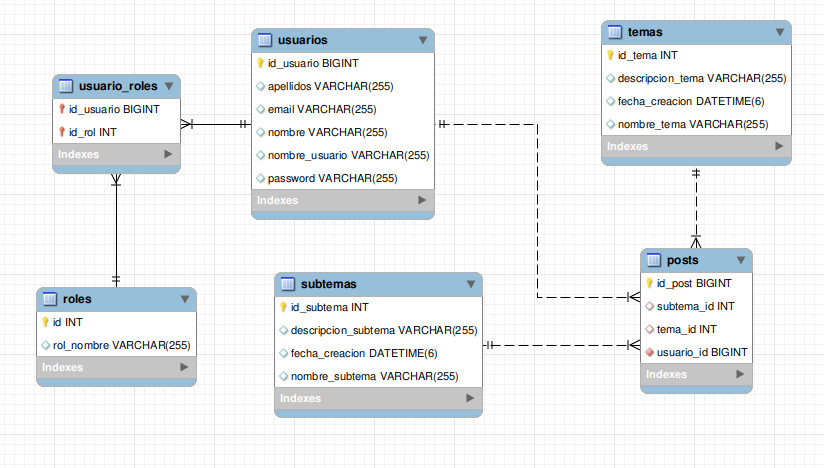

# Spring Blogru Project Backend v1.0

Proyecto backend para el proyecto Blogru

## Despliegue

* [Blogru Deploy Swagger](https://spring-blogru-backend.herokuapp.com/swagger-ui/index.html)

## Descripción

Para la realización de este proyecto se usó Spring Boot v2.6.2.

## Inicio

### Dependencias

* Spring v2.6.2, Spring JPA, MySQL driver, PostgreSql driver, Java 8 u 11.
* MongoDb driver para guardar los contenidos.
* Sistema operativo independiente

### Instalación

* Clonar el repositorio
```
git clone https://github.com/Capdoo/spring-blogru-backend.git

```

* Crear la Base de Datos usando MySQL
```
CREATE DATABASE blogru CHARACTER SET utf8 COLLATE utf8_general_ci;

```


### Editar propiedades

* Es necesario modificar el archivo application.properties
* Se debe indicar el nombre de usuario y contraseña de la Base de Datos

#### MySQL para almacenar usuarios y meta data

```
spring.datasource.url=jdbc:mysql://<host>:<port>/<bd-name>
spring.datasource.username=<username>
spring.datasource.password=<password>
spring.datasource.driver-class-name=com.mysql.cj.jdbc.Driver
```

#### PosgreSQL para despliegue

```
spring.datasource.url=jdbc:postgresql://<host>:<port>/<bd-name>?user=<username>&password=<password>
spring.datasource.driver-class-name=org.postgresql.Driver
spring.jpa.properties.hibernate.dialect = org.hibernate.dialect.PostgreSQL10Dialect
```

#### MongoDB para almacenar los recursos (contenidos)

```
spring.data.mongodb.database=blogdb
spring.data.mongodb.repositories.enabled= true
spring.data.mongodb.uri=mongodb+srv://<username>:<password>@<host>/<bd-name>
```

## Ejecución

Iniciar el proyecto a través del IDE de su preferencia
```
Realizar build al proyecto
Actualizar dependencias en pom.xml
Verificar versiones en las dependencias
```

## Base de Datos


## Authors

Contribuidores

. [@Capdoo](https://github.com/Capdoo)


## License

This project is licensed under the terms of the MIT license.

## Acknowledgments

MongoDB y Spring Boot: Colecciones y documentos.
* [MongoDB SpringBoot - Baeldung](https://www.baeldung.com/spring-data-mongodb-tutorial)